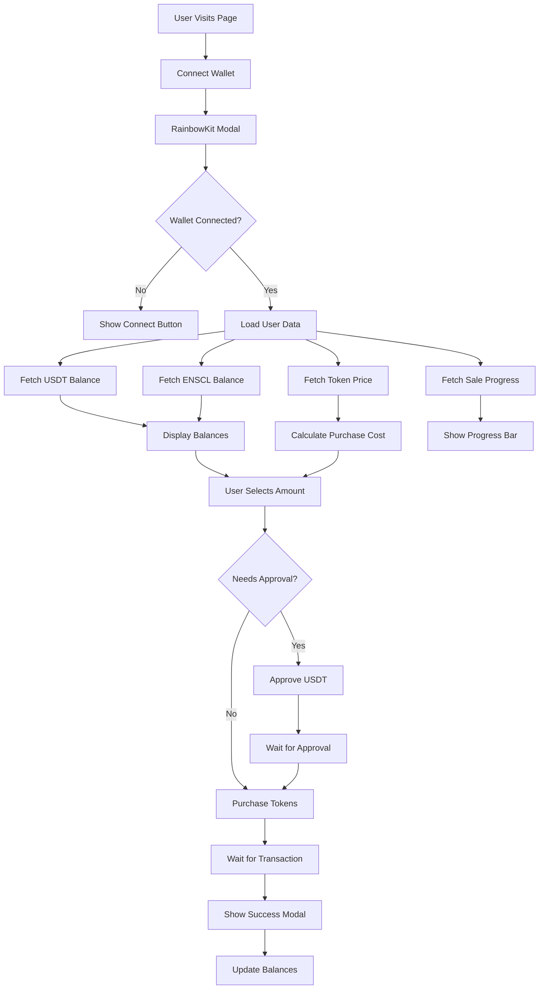
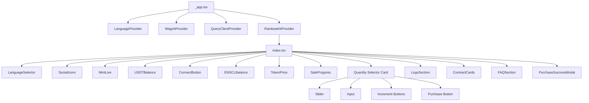
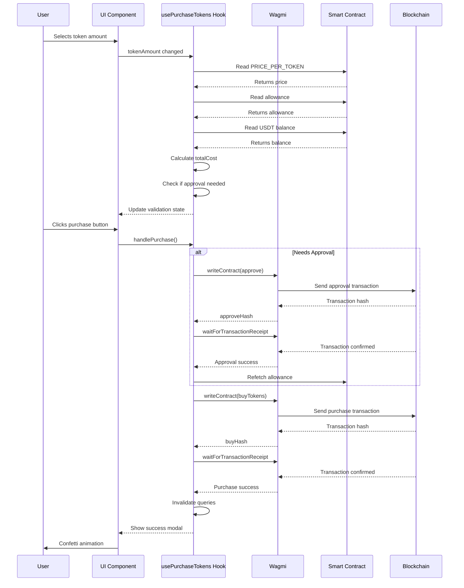
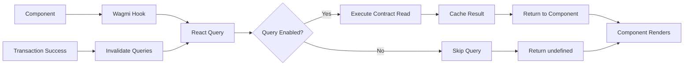

# ENSCHILE Token Sale Landing Page

A modern, production-ready token sale interface built for the ENSCHILE project. This application provides a seamless Web3 experience for purchasing ENSCL tokens using USDT on Ethereum mainnet.

## Overview

This is a Next.js-based single-page application that handles token purchases through smart contract interactions. The platform features real-time balance updates, transaction tracking, and a fully responsive design that works across all device types.

The application is designed with security and user experience as top priorities. Every transaction is validated before submission, errors are handled gracefully, and users receive clear feedback at every step of the purchase process.

## Technology Stack

### Core Framework

**Next.js 15.3.3** - The foundation of the application. We're using static export mode (`output: 'export'`) which generates a fully static site that can be deployed to any CDN or static hosting service. This approach offers several advantages:

- Zero server costs - runs entirely on static hosting
- Global CDN distribution for optimal performance
- Enhanced security - no server-side attack surface
- Simple deployment workflow

The static export configuration is ideal for this use case since all blockchain interactions happen client-side through wallet connections.

**React 19.1.0** - Latest React version with improved concurrent rendering capabilities. The application leverages React hooks extensively for state management and side effects.

**TypeScript 5.5.4** - Strict mode enabled for type safety. All contract interactions are fully typed using ABI definitions, preventing runtime errors from incorrect function calls or parameter types.

### Web3 Integration

**Wagmi 2.17.4** - The core library for Ethereum interactions. Wagmi v2 provides a modern, hook-based API that simplifies contract reads and writes. Key features we're leveraging:

- Automatic query caching and refetching
- Built-in transaction receipt waiting
- Chain-agnostic architecture
- Type-safe contract interactions via ABI types

**RainbowKit 2.2.9** - Wallet connection UI that supports 20+ wallet providers out of the box. Handles wallet detection, connection flows, and network switching automatically.

**Viem 2.40.3** - Low-level Ethereum library that Wagmi uses under the hood. Provides utilities for encoding/decoding contract calls, handling BigInt values, and formatting units.

### State Management

**TanStack Query (React Query) 5.55.3** - Manages all asynchronous state including contract reads, balances, and transaction status. Provides:

- Automatic background refetching
- Request deduplication
- Optimistic updates
- Cache invalidation strategies

The application uses React Query's predicate-based invalidation to refresh related data after successful transactions (e.g., invalidating USDT balance queries after a purchase).

### UI Components

**Radix UI** - Headless component primitives that provide accessibility and keyboard navigation out of the box. We're using:

- Accordion for FAQ section
- Dialog for success modals
- Progress for sale progress indicators
- Slider for token amount selection
- Select, Switch, Tabs, and other form controls

**Tailwind CSS 3.4.13** - Utility-first CSS framework with a custom design system. The configuration includes:

- Custom color palette with HSL variables for theme support
- Extended gradient utilities
- Custom animations (accordion, float, shimmer)
- Responsive breakpoints

**shadcn/ui** - Component library built on Radix UI and Tailwind. The "new-york" style variant provides a clean, modern aesthetic.

**Lucide React** - Icon library with consistent stroke width and styling. All icons are tree-shakeable, keeping bundle size minimal.

### Internationalization

**Custom i18n Implementation** - Lightweight solution using React Context and JSON message files. Supports English and Spanish with:

- LocalStorage persistence for language preference
- Nested key support (e.g., `home.tokenPrice.title`)
- Variable interpolation in translations
- Type-safe translation keys via TypeScript

The implementation is simpler than libraries like next-intl since we only need client-side translations for a single-page app.

### Additional Libraries

**canvas-confetti** - Celebration animation on successful purchases. Provides visual feedback that makes the transaction feel rewarding.

**react-country-flag** - Visual language selector component.

## Architecture

### Application Flow



### Component Hierarchy



### Transaction Flow



### Data Fetching Pattern



## Security Analysis

### Smart Contract Interactions

All contract interactions go through Wagmi's type-safe hooks. The ABI definitions ensure that function names and parameters match exactly what the contracts expect.

**Approval Flow Security:**
- Only approves the exact amount needed for the current purchase
- Checks allowance before attempting purchase
- Validates balance before allowing approval
- Prevents double-spending by checking available tokens

**Transaction Validation:**
The `usePurchaseTokens` hook performs multiple validation checks before allowing any transaction:

1. **Connection Check** - Verifies wallet is connected
2. **Balance Validation** - Ensures user has sufficient USDT
3. **Token Availability** - Confirms tokens are available for purchase
4. **Amount Validation** - Ensures amount is greater than zero
5. **Price Validation** - Verifies token price is available and non-zero
6. **Cost Calculation** - Validates total cost calculation succeeded

These validations happen client-side before the transaction is sent, saving users gas fees on failed transactions.

### Error Handling

The application implements comprehensive error handling at multiple levels:

**Transaction Errors:**
- User rejection is detected and shown with a friendly message
- Reverted transactions extract revert reasons when available
- Network errors are caught and displayed
- Insufficient balance errors are caught before transaction submission

**Contract Read Errors:**
- Missing contract addresses are handled gracefully
- Network disconnections show appropriate messages
- Invalid contract responses are caught

**Input Validation:**
- Token amount is clamped between 1 and MAX_VALUE (50,000)
- Input parsing handles comma-separated numbers
- Slider and input stay synchronized

### Environment Variables

All sensitive configuration is managed through environment variables:

- Contract addresses are read from `NEXT_PUBLIC_*` variables
- WalletConnect project ID is required for RainbowKit
- No private keys or secrets are stored in the codebase

The `.env.example` file documents all required variables without exposing actual values.

### Client-Side Security

Since this is a static export, there's no server-side attack surface. All security considerations are client-side:

- Wallet connections are handled by wallet providers (MetaMask, WalletConnect, etc.)
- Private keys never leave the user's wallet
- Transactions are signed in the user's wallet application
- The application never has access to user funds

## UX/UI Patterns

### Responsive Design

The application uses a mobile-first approach with Tailwind's responsive breakpoints:

- **Mobile (< 768px)**: Single column layout, stacked header elements, full-width cards
- **Tablet (768px - 1024px)**: Two-column layout for stats and purchase card
- **Desktop (> 1024px)**: Optimized spacing, side-by-side layout, enhanced visual effects

The header adapts dynamically:
- Desktop: Logo, balances, and connect button in a row
- Mobile: Logo centered, controls stacked below

### Loading States

Every asynchronous operation shows appropriate loading feedback:

- **Contract Reads**: Skeleton states or "..." placeholders
- **Transactions**: Disabled buttons with spinner icons
- **Approval Process**: Button text changes to "Approving..."
- **Purchase Process**: Button text changes to "Purchasing..."

The `isLoading` and `isProcessing` states prevent duplicate transactions and provide clear visual feedback.

### Error Feedback

Errors are displayed in a dedicated error container above the purchase button:

- Red background with border for visibility
- Alert icon for quick recognition
- Full error message with word wrapping
- Errors clear automatically when conditions change

### Success Feedback

Successful purchases trigger multiple feedback mechanisms:

1. **Confetti Animation** - 3-second celebration animation
2. **Success Modal** - Detailed transaction summary
3. **Balance Updates** - Automatic refresh of all balances
4. **Form Reset** - Token amount resets to 1

The modal includes:
- Transaction hash with Etherscan link
- Tokens purchased amount
- Total cost in USDT
- "Add to MetaMask" button for convenience

### Accessibility

The application follows accessibility best practices:

- **Keyboard Navigation**: All interactive elements are keyboard accessible
- **Screen Readers**: Radix UI components include ARIA attributes
- **Color Contrast**: Text meets WCAG AA standards
- **Focus Indicators**: Visible focus states on all interactive elements
- **Semantic HTML**: Proper heading hierarchy and landmark elements

### Internationalization

The i18n system supports:

- **Language Persistence**: Selected language saved to localStorage
- **Nested Translations**: Organized by feature (home, contracts, faq, etc.)
- **Variable Interpolation**: Dynamic values in translations (e.g., token counts)
- **RTL Ready**: Structure supports right-to-left languages if needed

Language selector is prominently placed in the header for easy access.

### Visual Design

The design system uses a dark theme with blue/cyan accents:

- **Background**: Gradient from slate-900 through blue-900 to indigo-900
- **Cards**: Dark backgrounds with blue borders and subtle gradients
- **Accents**: Cyan and blue gradients for important information
- **Patterns**: Subtle dot patterns and gradient overlays for depth

Interactive elements have hover states that enhance the blue/cyan theme, creating a cohesive visual experience.

## Development

### Prerequisites

- Node.js 18+ 
- npm or yarn
- Ethereum wallet (for testing)

### Setup

1. Clone the repository
2. Install dependencies:
```bash
npm install
```

3. Copy `.env.example` to `.env.local` and fill in the values:
```
NEXT_PUBLIC_USDT_CONTRACT_ADDRESS=0x...
NEXT_PUBLIC_ENSCL_CONTRACT_ADDRESS=0x...
NEXT_PUBLIC_TOKEN_SALE_CONTRACT_ADDRESS=0x...
NEXT_PUBLIC_PROJECT_ID=your_walletconnect_project_id
NEXT_PUBLIC_INITIAL_TOKEN_SUPPLY=25000000
```

4. Run the development server:
```bash
npm run dev
```

5. Build for production:
```bash
npm run build
```

The static files will be in the `out/` directory, ready for deployment to any static hosting service.

### Project Structure

```
src/
├── abis/              # Smart contract ABIs (TypeScript)
├── components/        # React components
│   ├── ui/           # shadcn/ui components
│   └── ...           # Feature components
├── contexts/          # React contexts (Language)
├── hooks/            # Custom React hooks
├── lib/              # Utility functions
├── messages/          # i18n translation files
├── pages/            # Next.js pages
├── styles/           # Global CSS
└── types/            # TypeScript type definitions
```

### Key Files

- `src/pages/index.tsx` - Main landing page component
- `src/hooks/usePurchaseTokens.ts` - Token purchase logic
- `src/hooks/useTokenPrice.ts` - Token price fetching
- `src/wagmi.ts` - Wagmi configuration
- `src/contexts/LanguageContext.tsx` - i18n implementation

### Code Patterns

**Custom Hooks:**
The application uses custom hooks to encapsulate business logic:
- `usePurchaseTokens` - Handles entire purchase flow
- `useTokenPrice` - Fetches and formats token price
- `useLanguage` - Provides translation function

**Component Composition:**
Large components are broken into smaller, focused components:
- `SaleProgress` - Displays sale statistics
- `TokenPrice` - Shows current token price
- `ENSCLBalance` - Displays user's ENSCL balance
- `USDTBalance` - Displays user's USDT balance

**State Management:**
- Local state for UI (slider values, modals)
- React Query for server/contract state
- Context for global app state (language)

## Deployment

The application builds to a static site in the `out/` directory. This can be deployed to:

- **Vercel** - Automatic deployments from Git
- **Netlify** - Static site hosting
- **Cloudflare Pages** - Global CDN distribution
- **AWS S3 + CloudFront** - Enterprise hosting
- **GitHub Pages** - Free hosting for open source

No server configuration is needed - just upload the `out/` directory contents.

## Future Enhancements

Potential improvements for future iterations:

- Multi-chain support (currently Ethereum mainnet only)
- Transaction history tracking
- Referral system integration
- Advanced analytics dashboard
- Email notifications for transactions
- Social sharing features
- Token vesting schedule display

## License

[Add your license here]

## Support

For issues or questions, please open an issue on the repository or contact the development team.


